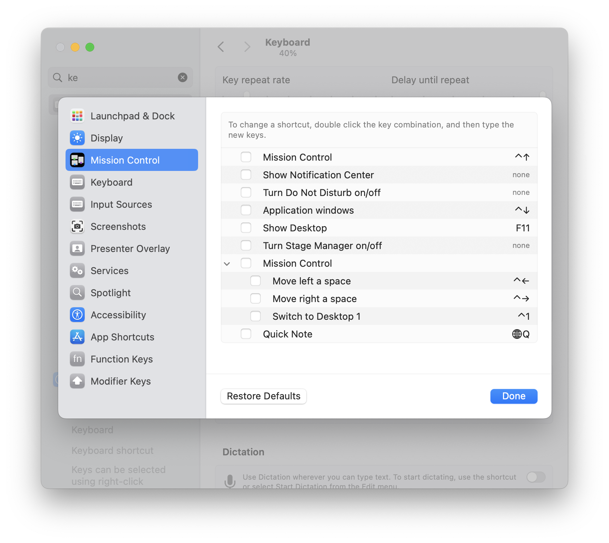
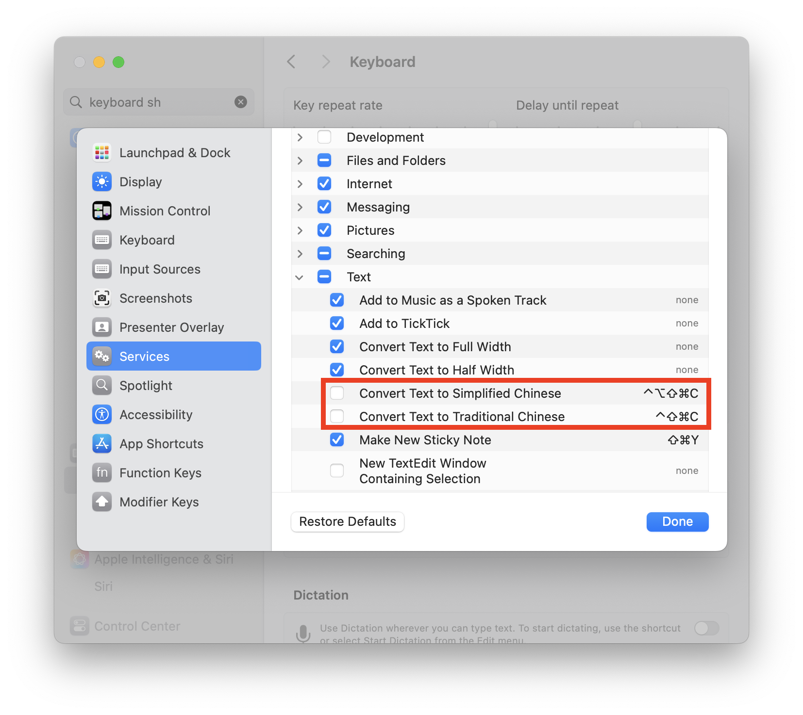

# dotfiles

**Step 1:** Install [oh-my-zsh](https://ohmyz.sh)

    /bin/bash -c "$(curl -fsSL https://raw.githubusercontent.com/ohmyzsh/ohmyzsh/master/tools/install.sh)"

**Step 2:** Install [Homebrew](https://brew.sh)

    /bin/bash -c "$(curl -fsSL https://raw.githubusercontent.com/Homebrew/install/HEAD/install.sh)"

**Step 3:** Install [Node Version Manager](https://github.com/nvm-sh/nvm#readme)

    /bin/bash -c "$(curl -fsSL https://raw.githubusercontent.com/nvm-sh/nvm/v0.40.1/install.sh)"

**Step 4:** Install [Node](https://nodejs.org)

    nvm install node

**Step 5:** Install [Bun](https://bun.sh)

    curl -fsSL https://bun.sh/install | bash

**Step 6:** Clone `dotfiles` repository

    git clone https://github.com/wagerfield/dotfiles.git && cd dotfiles

**Step 7:** Install `brew` packages and casks

    brew bundle

**Step 8:** Stow directories to `$HOME` directory

    stow claude ghostty git kitty lazygit nvim oh-my-zsh ssh vim yazi zed zsh --target $HOME

You will likely have to delete (or rename) some files like `$HOME/.zshrc` that already exist before running `stow`.

## Brew Commands

| Command                          | Description                      |
| -------------------------------- | -------------------------------- |
| `brew help`                      | View `brew` commands             |
| `brew update`                    | Update `brew`                    |
| `brew doctor`                    | Check `brew` installation        |
| `brew cleanup`                   | Cleanup `brew` packages          |
| `brew outdated`                  | List outdated `brew` packages    |
| `brew upgrade`                   | Upgrade outdated `brew` packages |
| `brew tap`                       | List `brew` taps                 |
| `brew list`                      | List `brew` packages             |
| `brew (un)install <package>`     | (Un)install `brew` package       |
| `brew (un)install --cask <cask>` | (Un)install `brew` cask          |

## Mac Configuration

    bash macos.sh

### Disable Mission Control Keyboard Shortcuts

    Settings --> Keyboard --> Keyboard Shortcuts --> Mission Control

### Disable Chinese Keyboard Shortcuts

    Settings --> Keyboard --> Keyboard Shortcuts --> Services --> Text

## SSH

Create separate SSH keys for different emails:

    ssh-keygen -t ed25519 -C "matthew@wagerfield.com" -f ~/.ssh/id_ed25519
    ssh-keygen -t ed25519 -C "matthew.wagerfield@progleasing.com" -f ~/.ssh/prg_ed25519
