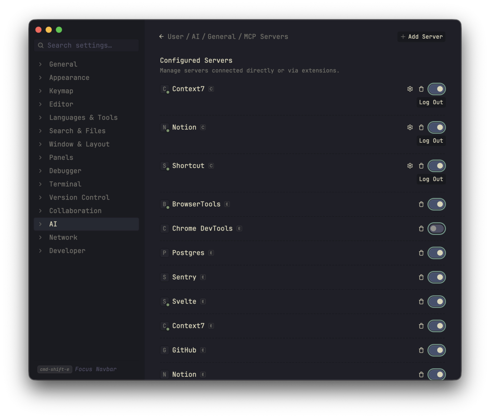

# Zed

## MCP OAuth

Context7, Granola, Notion, Shortcut, and Slack use hosted MCP servers. Tokens stay out of `settings.json` — Zed stores the session in the keychain.

Open **Settings → AI → MCP Servers → Configure** (`cmd-,`, then AI), or run `agent: open settings` from the command palette and open **MCP Servers**.

The OAuth servers sit at the top of **Configured Servers**. Each has a toggle and either **Authenticate** or **Log Out**:

1. Turn the server **on**.
2. Click **Authenticate**.
3. Approve access in the browser, then return to Zed.
4. A green status dot and **Log Out** mean the session is active.

Use **Log Out** on that row if you need to sign in again. Do not paste API keys into `settings.json` for these three.

## Missing Features

- Project Panel
  - Search/filter Project Panel like the Outline Panel
- Git Panel
  - Staged files group alongside Tracked and Untracked in Git Panel
- Agent Panel
  - Edit previous message
- Terminal Panel
  - Paste image file (not filename) from clipboard
  - Adjust font cell width and height like Kitty and Ghostty
- Debug Panel
  - Keyboard navigation does not appear to work?
  - Extra border on the right edge of the panel that should be removed
- Vim Mode
  - Support AnyQuotes and MiniQuotes for surround commands
  - Vim sneak highlight styling
